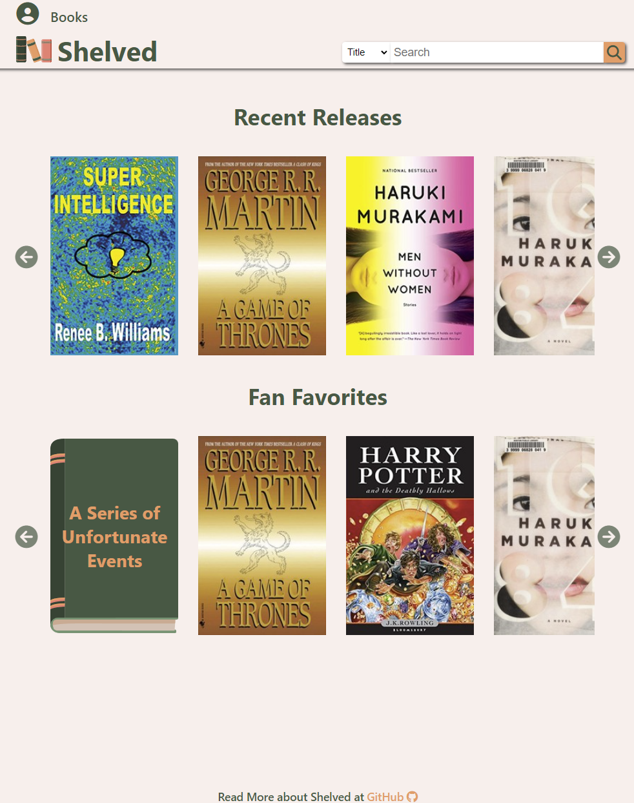
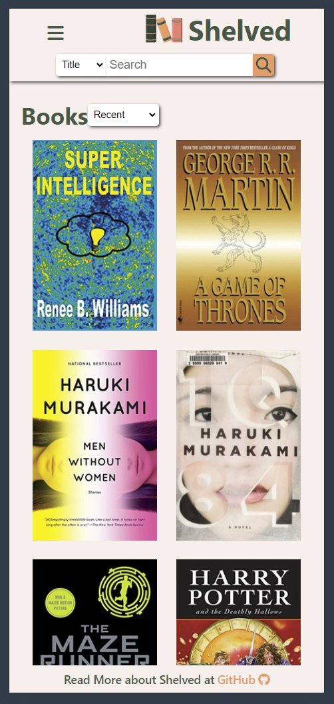

#  Shelved - Front End

**Shelved** is a book review application made using React on the front end and JavaScript on the back end. Users come to **Shelved** to look into books they are interested in as well as books they've read before. User are encourage to rate and review books they've read to create discourse amongst all users.

Users can track novels to two lists: Favorites and Future Reads. With these lists, users can express their reading preferences to potiental followers. 

This is a MERN Stack application that includes JWT Authentication.

Read more about [Shelved - Back End](https://github.com/Reizor-75/Shelved-back-end)

## Getting Started ✅
🌐[Try Shelved!](https://shelved.netlify.app/)

🗒️[Planning Materials](https://trello.com/b/mHVSYVS2/shelved)

## Attributions 📣
Shelved uses [Open Library API](https://openlibrary.org/dev/docs/restful_api) to search and populate its database for users to interact with.

Shelved borrows from [Neil Pomerleau's](https://codepen.io/neilpomerleau/pen/wzxzQM) guide in creating a purely CSS star rating input.

Shelved uses [NPM React Tiny Popover](https://www.npmjs.com/package/react-tiny-popover) library to create simple feedback messages for users.

**Image Assets:** **Shelved** uses icons sourced from [fontawesome.com](https://fontawesome.com/)

Shelved's logo and default assets are created by yours truly.

## Technologies used 🖥

- Fly.io for deployment

## Ice Box Features 🧊
- [x] Mobile Friendly
- [x] Users can add to following
- [ ] Users can accept/reject friend request
- [ ] Users instant messaging/inbox
- [ ] Create Author account type
- [ ] Author accounts can add their own books to database